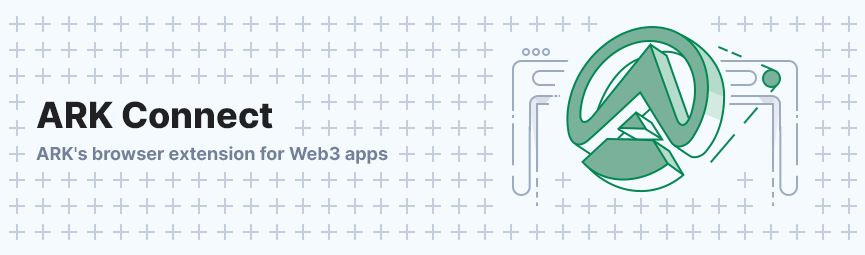

# ARK Connect Extension



ARK Connect is a browser extension for Chrome and Firefox that offers message and transaction signing. ARK Connect allows users to log in, approve actions and interact with the ARK Ecosystem.

## Development

### Requirements

- [Node >= 18](https://nodejs.org/en)
- [pnpm](https://pnpm.io/)

### Used Packages

- [vite](https://vitejs.dev/)
- [vite-plugin-web-extension](https://github.com/samrum/vite-plugin-web-extension)
- [webextension-polyfill](https://www.npmjs.com/package/webextension-polyfill)
- [formik](https://formik.org/docs/overview)
- [Redux Toolkit](https://redux-toolkit.js.org/)
- [ArdentHQ Platform SDK](https://github.com/ArdentHQ/platform-sdk)
- [ESLint](https://eslint.org/)
- [Styled components](https://styled-components.com/)
- [Styled system](https://styled-system.com/)

### Setup

1. Clone this repository with `git clone git@github.com:ArdentHQ/arkconnect-extension.git`
2. Setup your `.env` by running `cp .env.example .env` and adjusting it to your needs
3. Install dependencies with `pnpm i`
4. Run the application with `pnpm dev`

### Building

Building results in a browser-specific build. There are two commands that exists to achieve this:

```bash
pnpm build:chrome
pnpm build:firefox
```

Pick the one applicable for your environment and it will generate a build in the `/dist` folder.

#### Adding the extension to Chrome

- When the build completes, open Chrome or Edge and navigate to `chrome://extensions`. Make sure to turn on the developer mode switch.
- Click on the "Load unpacked extension" button
- Select the `dist` folder in this project (after `pnpm dev` or `pnpm build:chrome`)

#### Adding the extension to Firefox

- When the build completes, open Firefox and navigate to `about:debugging`.
- Click on the "This Firefox" button
- Click on "Load temporary add-on"
- Select the `manifest.json` file that is inside the `dist` folder

## Documentation

For usage on a website, please refer to the dedicated [Documentation](./DOCUMENTATION.md) file

## Releasing

Builds are generated automatically by the GitHub workflows on the `develop` and `main` branches. These can be used to upload to the web extension stores.

For bumping the version number, update `package.json` with `npm version <major|minor|patch> --no-git-tag-version` or by manually incrementing the number

## Troubleshooting

> This section will highlight common issues and their solutions

The extension expects to run on port `5173` when running `pnpm dev`. In case you run into the extension being a small white square when opening, it generally means that port `5173` is used by another (vite) process already and your development instance is running on another port. Make sure to close anything running on port `5173` and try with `pnpm dev` again.
